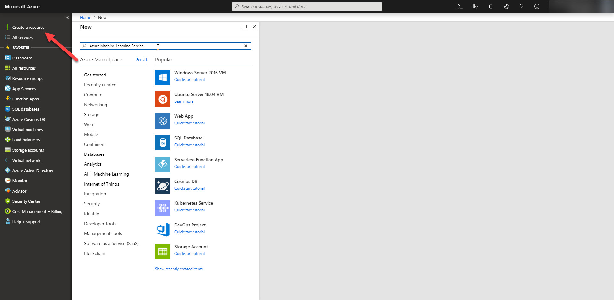
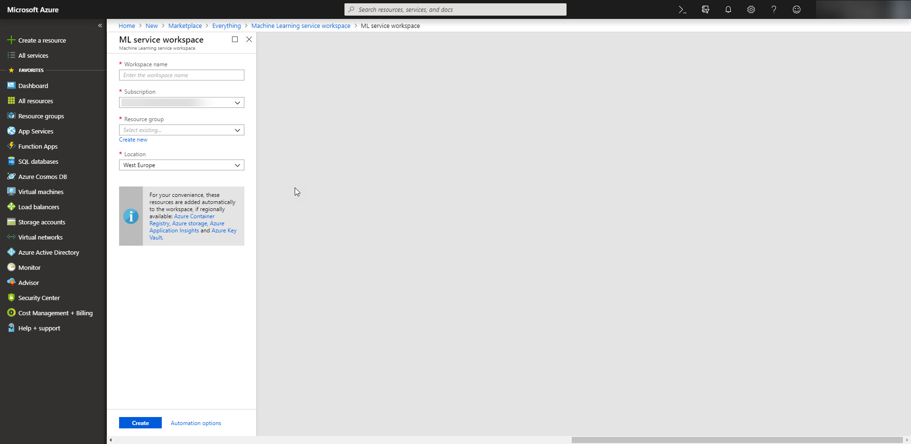
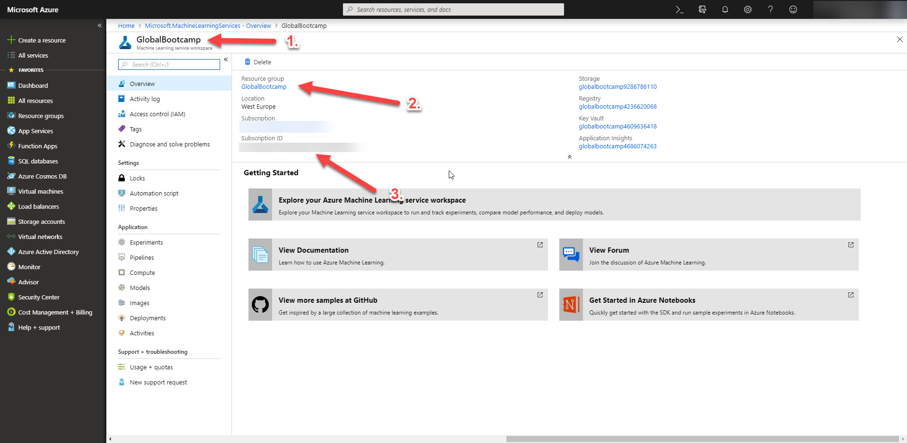
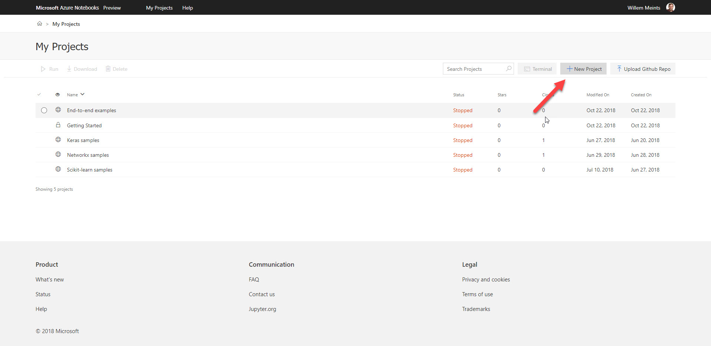
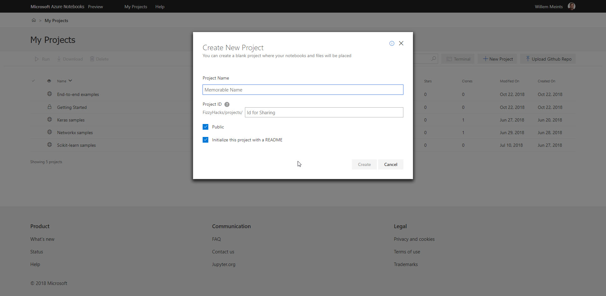
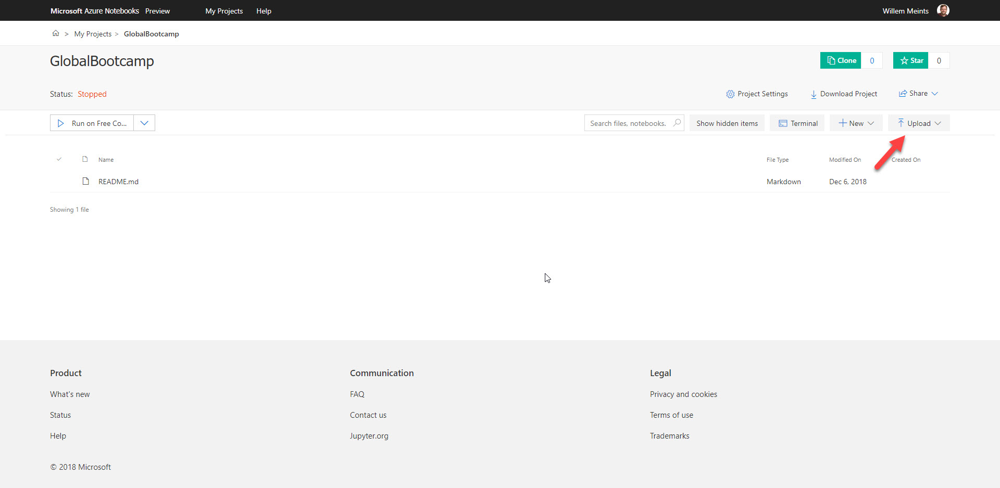
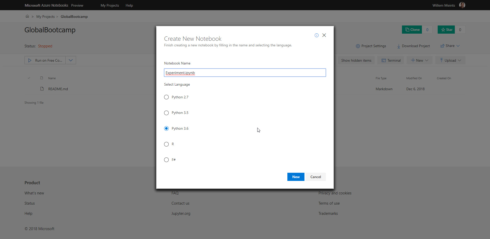
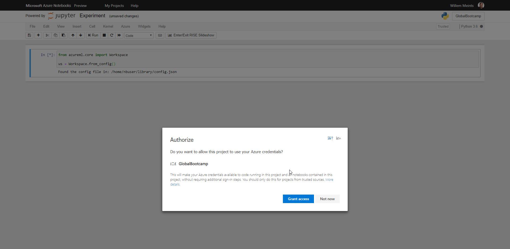

# Lab 1: Set up Azure Machine Learning Services
In this lab we will set up a new Azure Machine Learning Service on the Azure Portal. You will need this environment later on to build your experiments.

In this lab you will learn the following:

 * How to configure Azure Machine Learning Service
 * How to connect to the Azure Machine Learning Service instance
 * Where to find different concepts within the Azure Machine Learning Service environment

## Step 1: Start the wizard
Navigate to the portal and click the "Add new resource" button in the top left corner of the portal. 



Search for "Machine learning workspace" and select it from the available resource types.

Click "Create". To start the wizard to create the new resource in your Azure environment.

## Step 2: Provide the properties for your workspace
When you click the "Create" button you get a new window. In this window you need to provide the properties for the new resource.



Give the workspace a name and assign a resource group to the workspace. 

Make sure you create a dedicated resource group for the workspace. It will contain a lot of resources when everything you're done.

Click the "Create" button again to start the deployment process. Please note that it takes a few minutes to deploy the workspace.

## Step 3: Create a configuration file for connecting to the workspace
Once the deployment is completed, navigate to your newly created workspace. We're now
going to create a new configuration file that we will use later to connect to the machine
learning workspace.



Create a new file `config.json` with the following content:

```
{
    "workspace_name": "<workspace name>",
    "resource_group": "<resource group>",
    "subscription_id": "<your subscription id>"
}
```

Replace the placeholders in the with the values from the machine learning 
workspace properties:

 1. workspace_name
 2. resource_group
 3. subscription_id

Check the image above for details where to find the properties. 

Keep `config.json` handy, you're going to need it in the next step of the lab.

## Step 4: Connect to your workspace
In this final step we will connect to the machine learning workspace from an 
Azure Notebook.

Navigate to https://notebooks.azure.com and sign in, using the button in the 
top-right corner of the page.



In the next page, select "My projects" in the navigation bar and create 
a new project. Give it a descriptive name and a memorable identifier for 
the URL.



Click the "Create" button to create the new project.
You are now redirected to the project details page.



On this page, click the upload button and upload the `config.json` 
to the project. This file is needed later on to create a connection.

Next click on the "New" button and create a new notebook. This is where you will
write all the code for the experiment later on.



Make sure you give it the name "Experiment.ipynb" and select the Python 3.6 runtime.
Now click "New" in the dialog to confirm the new notebook.

Click the new notebook to open it in your browser. In the newly created notebook we're going to set up our workspace connection.

In the empty cell at the top of the notebook, copy and paste the following code:

```
from azureml.core import Workspace

ws = Workspace.from_config()
```

Execute the cell by pressing <kbd>Ctrl></kbd>+<kbd>Enter</kbd>.



The notebook will ask you to grant access to your Azure credentials. Confirm
the settings by clicking the "Grant access" button.

The notebook should now run the code and display the following line:

```
Found the config file in: /home/nbuser/library/config.json
```

This means the connection is now made and you're ready to move on to the next
lab!

## Summary
In this lab we learned how to set up a new workspace on the Azure Management Portal.
We've also looked at how to configure a connection to the machine learning workspace.
Finally we've created a new Azure Notebook in preparation of our new experiment.

Feel free to look around the newly created machine learning workspace.

When you're done you can [start working on lab 2](../lab2/README.md).